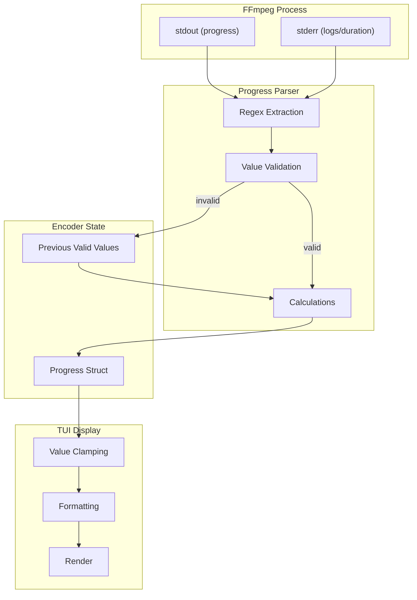
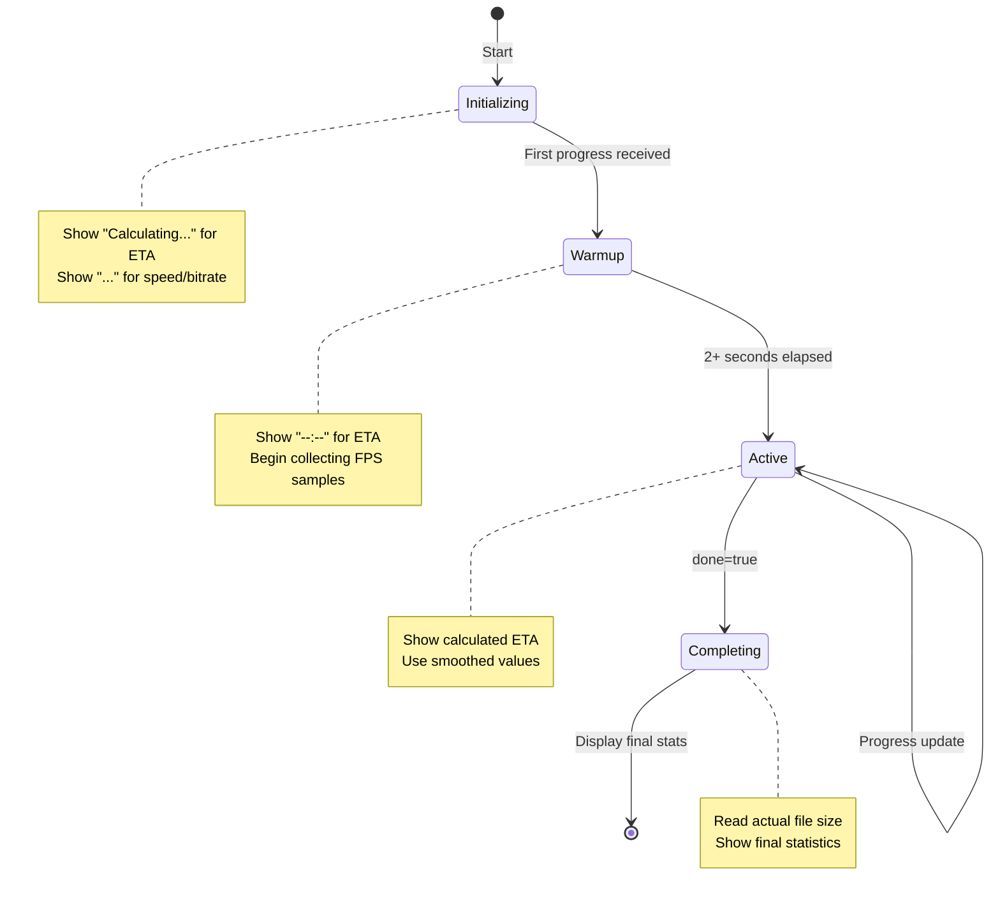

# Design Document: TUI Accuracy Fix

## Overview

This design addresses accuracy issues in the svt-av1-encoder TUI by implementing robust progress parsing, validation, and display logic. The solution focuses on three key areas:

1. **Input Validation**: All parsed values are validated before use
2. **Graceful Fallbacks**: When primary data sources fail, fallback calculations are used
3. **Display Safety**: All displayed values are clamped and formatted consistently

The implementation modifies the existing `encoder/ffmpeg.go` and `tui/view.go` files while maintaining backward compatibility with the current architecture.

## Architecture



## Components and Interfaces

### 1. Enhanced Progress Struct

The `Progress` struct in `encoder/ffmpeg.go` will be extended with additional fields for validation and state tracking:

```go
type Progress struct {
    // Existing fields
    Frame         int64
    FPS           float64
    Bitrate       string
    TotalSize     int64
    OutTimeUs     int64
    Speed         string
    Percentage    float64
    TotalFrames   int64
    TotalDuration time.Duration
    ETA           time.Duration
    
    // New fields for accuracy
    SpeedRaw        string        // Raw speed string from FFmpeg (may be "N/A")
    BitrateRaw      string        // Raw bitrate string from FFmpeg
    ETAAvailable    bool          // Whether ETA can be calculated
    StartTime       time.Time     // When encoding started (for warmup detection)
    LastValidFPS    float64       // Last known good FPS value
    LastValidSpeed  float64       // Last known good speed multiplier
    FrameEstimated  bool          // Whether TotalFrames is estimated vs actual
}
```

### 2. Progress Parser Functions

New helper functions for robust parsing:

```go
// parseSpeed extracts speed multiplier from FFmpeg output
// Returns (speed float64, raw string, ok bool)
func parseSpeed(line string) (float64, string, bool)

// parseBitrate extracts bitrate from FFmpeg output
// Returns (normalized string, raw string, ok bool)  
func parseBitrate(line string) (string, string, bool)

// clampPercentage ensures percentage is within 0-100
func clampPercentage(pct float64) float64

// calculateETA computes ETA with smoothing
func (e *Encoder) calculateETA() time.Duration

// validateProgress checks all progress values for sanity
func (p *Progress) validate() bool
```

### 3. Frame Estimator Improvements

Enhanced `GetTotalFrames()` with better fallback handling:

```go
func (e *Encoder) GetTotalFrames() error {
    // 1. Try nb_frames from container (most accurate)
    // 2. Try duration * fps calculation
    // 3. Set FrameEstimated flag appropriately
    // 4. Log warning if estimation fails
}

func (e *Encoder) parseFrameRate(fpsStr string) float64 {
    // Handle "24/1", "24000/1001", "23.976" formats
}
```

### 4. Display Formatting Functions

Enhanced formatting in `tui/view.go`:

```go
// formatProgressValue returns display string with placeholder handling
func formatProgressValue(value interface{}, placeholder string) string

// formatSpeed handles N/A and missing speed values
func formatSpeed(raw string, parsed float64) string

// formatBitrate handles N/A and missing bitrate values
func formatBitrate(raw string) string

// formatETA handles unavailable ETA gracefully
func formatETA(eta time.Duration, available bool, warmup bool) string
```

### 5. Completion Handler

New function to get actual file size on completion:

```go
func (e *Encoder) GetActualOutputSize() (int64, error) {
    info, err := os.Stat(e.OutputPath)
    if err != nil {
        return 0, err
    }
    return info.Size(), nil
}
```

## Data Models

### Progress State Machine



### Validation Rules

| Field | Valid Range | Invalid Action |
|-------|-------------|----------------|
| Frame | >= 0 | Keep previous |
| FPS | >= 0 | Keep previous, use 0 for display |
| TotalSize | >= 0 | Keep previous |
| Percentage | 0-100 | Clamp to range |
| TotalFrames | >= 0 | Set to 0, use duration fallback |
| Speed | > 0 or "N/A" | Show "N/A" |
| Bitrate | non-empty or "N/A" | Show "N/A" |

### Regex Patterns

Updated regex patterns for comprehensive FFmpeg output parsing:

```go
var (
    frameRe   = regexp.MustCompile(`frame=\s*(\d+)`)
    fpsRe     = regexp.MustCompile(`fps=\s*([\d.]+)`)
    // Enhanced bitrate: captures "1234kbits/s", "1.2Mbits/s", "N/A"
    bitrateRe = regexp.MustCompile(`bitrate=\s*([\d.]+\s*[kMG]?bits/s|N/A)`)
    sizeRe    = regexp.MustCompile(`total_size=\s*(\d+)`)
    timeRe    = regexp.MustCompile(`out_time_us=\s*(\d+)`)
    timeMsRe  = regexp.MustCompile(`out_time_ms=\s*(\d+)`)
    // Enhanced speed: captures "1.5x", "N/A", or empty
    speedRe   = regexp.MustCompile(`speed=\s*([\d.]+x|N/A)`)
)
```


## Correctness Properties

*A property is a characteristic or behavior that should hold true across all valid executions of a system—essentially, a formal statement about what the system should do. Properties serve as the bridge between human-readable specifications and machine-verifiable correctness guarantees.*

### Property 1: Percentage Clamping

*For any* percentage value (including negative values and values exceeding 100), the `clampPercentage` function SHALL return a value in the range [0, 100].

**Validates: Requirements 1.1, 1.5**

### Property 2: Frame-Based Percentage Calculation

*For any* valid frame count and total frames where total frames > 0, the calculated percentage SHALL equal (frame / totalFrames) * 100, clamped to [0, 100].

**Validates: Requirements 1.2**

### Property 3: Duration-Based Percentage Calculation

*For any* valid current time and total duration where total duration > 0, the calculated percentage SHALL equal (currentTime / totalDuration) * 100, clamped to [0, 100].

**Validates: Requirements 1.3**

### Property 4: Frame Estimation from Duration

*For any* valid duration (in seconds) and frame rate (fps > 0), the estimated frame count SHALL equal duration * fps (rounded to nearest integer).

**Validates: Requirements 2.2**

### Property 5: Fractional Frame Rate Parsing

*For any* frame rate expressed as a fraction "num/den" where den > 0, the `parseFrameRate` function SHALL return num/den as a float64.

**Validates: Requirements 2.3**

### Property 6: FPS-Based ETA Calculation

*For any* remaining frames > 0 and FPS > 0, the calculated ETA SHALL equal remaining_frames / FPS seconds.

**Validates: Requirements 3.1**

### Property 7: Speed-Based ETA Calculation

*For any* remaining duration and valid speed multiplier > 0, the calculated ETA SHALL equal remaining_duration / speed.

**Validates: Requirements 3.2**

### Property 8: Invalid Speed Returns Unavailable ETA

*For any* speed string that is "N/A", empty, or unparseable, the ETA calculation SHALL return a negative duration to indicate unavailability.

**Validates: Requirements 3.3**

### Property 9: ETA Smoothing

*For any* two consecutive ETA calculations where the underlying progress changed by less than 10%, the displayed ETA SHALL not change by more than 20% (smoothing factor).

**Validates: Requirements 3.5**

### Property 10: Speed Parsing

*For any* valid speed string matching the pattern `[\d.]+x` (e.g., "1x", "1.5x", "1.23x", "0.5x"), the `parseSpeed` function SHALL extract the numeric multiplier correctly.

**Validates: Requirements 4.1, 4.4**

### Property 11: Bitrate Parsing

*For any* valid bitrate string from FFmpeg (e.g., "1234kbits/s", "1.2Mbits/s", "N/A"), the `parseBitrate` function SHALL capture the value without data loss.

**Validates: Requirements 5.1**

### Property 12: Bitrate Normalization

*For any* captured bitrate value, the normalized output SHALL be in a consistent format (value + unit or "N/A").

**Validates: Requirements 5.4**

### Property 13: File Size Formatting

*For any* non-negative file size in bytes, the `formatBytes` function SHALL return a string using binary units (B, KiB, MiB, GiB, TiB) with the value correctly scaled.

**Validates: Requirements 6.4**

### Property 14: Placeholder Display for Missing Values

*For any* progress field that is empty, zero (where zero is invalid), or marked unavailable, the display function SHALL return a placeholder string ("...", "N/A", or "--:--" as appropriate) instead of empty string.

**Validates: Requirements 7.2**

### Property 15: Dynamic TotalFrames Adjustment

*For any* progress update where current frame exceeds TotalFrames, the TotalFrames SHALL be updated to at least the current frame count.

**Validates: Requirements 7.3**

### Property 16: Division by Zero Protection

*For any* calculation involving division, if the denominator is zero, the function SHALL return a safe default value (0 for percentages, negative duration for ETA) instead of panicking or returning NaN/Inf.

**Validates: Requirements 7.5**

### Property 17: Non-Negative Validation

*For any* parsed numeric value (frame count, FPS, file size), if the value is negative, the validation SHALL reject it and the previous valid value SHALL be retained.

**Validates: Requirements 8.1, 8.2, 8.3**

### Property 18: Previous Value Retention

*For any* progress update where a parsed value fails validation, the Progress struct SHALL retain the previous valid value for that field.

**Validates: Requirements 8.4**

## Error Handling

### Parse Errors

| Error Condition | Handling Strategy |
|-----------------|-------------------|
| Regex match fails | Keep previous value, continue parsing |
| Integer parse fails | Keep previous value, log debug message |
| Float parse fails | Keep previous value, log debug message |
| Negative value parsed | Reject, keep previous value |

### Calculation Errors

| Error Condition | Handling Strategy |
|-----------------|-------------------|
| Division by zero (percentage) | Return 0.0 |
| Division by zero (ETA) | Return -1 (unavailable) |
| Overflow in frame calculation | Cap at max int64 |
| NaN/Inf result | Return safe default |

### File System Errors

| Error Condition | Handling Strategy |
|-----------------|-------------------|
| Output file not found | Use progress TotalSize |
| Permission denied | Use progress TotalSize, log warning |
| Stat fails | Use progress TotalSize |

### Display Errors

| Error Condition | Handling Strategy |
|-----------------|-------------------|
| Empty string value | Show placeholder |
| Invalid duration | Show "--:--" |
| Negative percentage | Clamp to 0 |
| Percentage > 100 | Clamp to 100 |

## Testing Strategy

### Unit Tests

Unit tests will cover specific examples and edge cases:

1. **Parsing edge cases**:
   - Empty FFmpeg output lines
   - Malformed progress data
   - "N/A" values for all fields
   - Extreme values (very large frame counts, very small FPS)

2. **Formatting edge cases**:
   - Zero bytes
   - Exactly 1 KiB, 1 MiB, 1 GiB boundaries
   - Negative duration handling
   - Very long durations (>24 hours)

3. **State transitions**:
   - Initializing → Warmup → Active → Complete
   - Error state handling
   - Rapid completion scenarios

### Property-Based Tests

Property-based tests will use the `testing/quick` package (Go's built-in property testing) or `gopter` for more advanced generation.

**Configuration**:
- Minimum 100 iterations per property test
- Each test tagged with: `// Feature: tui-accuracy-fix, Property N: [description]`

**Test Organization**:
- `encoder/ffmpeg_test.go` - Parser and calculation properties
- `tui/view_test.go` - Display and formatting properties

### Test Coverage Matrix

| Requirement | Unit Tests | Property Tests |
|-------------|------------|----------------|
| 1.1-1.5 (Percentage) | Edge cases | P1, P2, P3 |
| 2.1-2.5 (Frame Est.) | Fallback scenarios | P4, P5 |
| 3.1-3.5 (ETA) | Warmup, N/A cases | P6, P7, P8, P9 |
| 4.1-4.4 (Speed) | N/A, empty cases | P10 |
| 5.1-5.4 (Bitrate) | Format variations | P11, P12 |
| 6.1-6.4 (File Size) | Completion, early | P13 |
| 7.1-7.5 (Edge Cases) | All edge cases | P14, P15, P16 |
| 8.1-8.5 (Validation) | Invalid inputs | P17, P18 |
